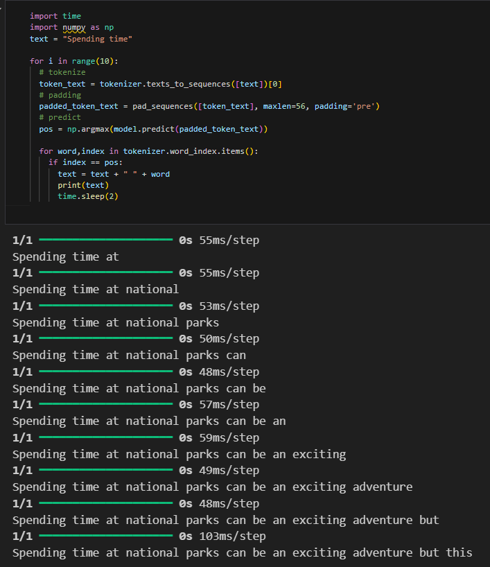
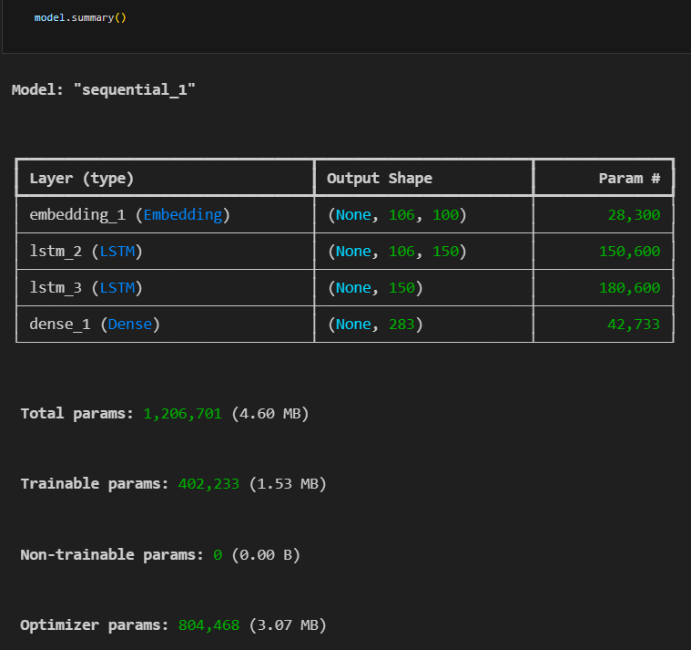

# 🧠 Text Generation using LSTM

This project demonstrates how to build a **Text Generation Model** using an **LSTM-based Recurrent Neural Network (RNN)** in **TensorFlow/Keras**.  
The model learns from a given text corpus and predicts the next word in a sequence — allowing it to generate new, coherent sentences based on learned patterns.

---

## 📄 Project Overview

The goal of this project is to train a model that can understand the **context of words** and **generate new text** word-by-word.  
A sample dataset (`faqs` variable) containing multiple paragraphs was used for training.

---

## ⚙️ Workflow Steps

1. **Import Libraries** – Loaded TensorFlow, Keras, and preprocessing tools.  
2. **Data Preparation** – Tokenized the input text and created word sequences.  
3. **Sequence Padding** – Standardized sequence lengths using `pad_sequences`.  
4. **Input & Output Creation** – Split data into input (`X`) and output (`y`) for supervised training.  
5. **Model Architecture** –  
   - Embedding layer  
   - Two stacked LSTM layers  
   - Dense output layer with Softmax activation  
6. **Model Training** – Trained using categorical crossentropy loss and Adam optimizer for 100 epochs.  
7. **Text Generation** – Given a seed text, the model predicts and appends words iteratively to generate new sentences.

---

## 🧩 Model Summary

| Layer (Type) | Output Shape | Parameters |
|---------------|---------------|-------------|
| Embedding     | (None, 106, 100) | 28,300 |
| LSTM (1)      | (None, 106, 150) | 150,600 |
| LSTM (2)      | (None, 150) | 180,600 |
| Dense         | (None, 283) | 42,733 |
| **Total Params** | **~400K** | — |

---

